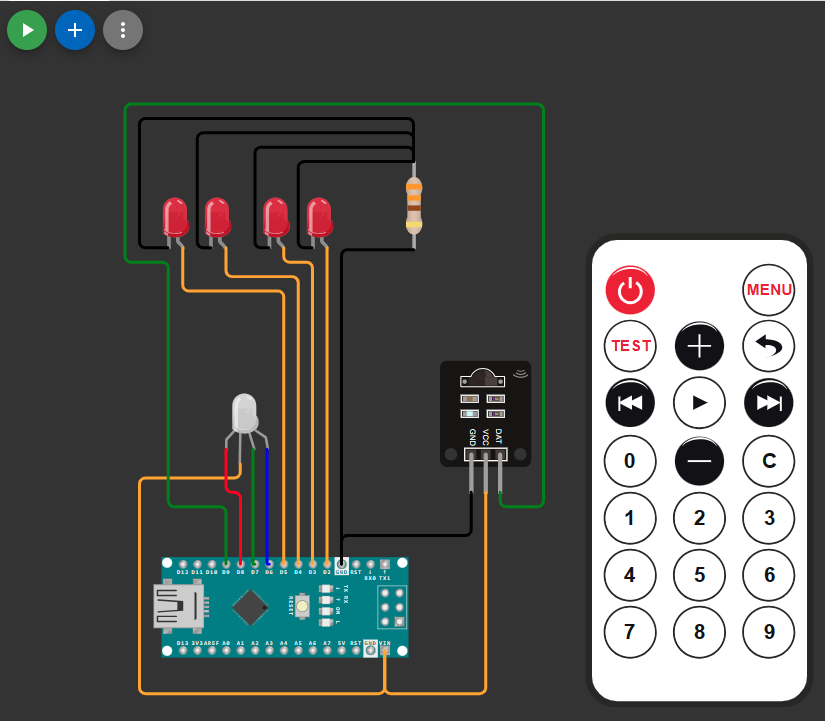

# Purpose
> The following is Embedded Systems second year project done for the university I am currently learning at.
> I used c instead of using arduino IDE to apply the content that we learnt during this year.
> Assembly was not used due to time restriction and limitations.

# Functionality
> The Lamp is intended to be operated using a remote control where the up and down buttons controls a sequence of LEDs with a 
> preprogrammed ligthing pattern.
> The following project works with 4 LEDs and 1 RGB LED, the brigthness of the 4 LEDs can be controlled using the volume up and down while the sequence is
> controlled using the Up and down arrows. The project can be improved by implementing the commented on/off state function and also by implementing the RGB
> LED to read the current charge of the battery.

# Implementation
> Use Atmel Studio and avrdude to program the micro-controller. Direct Implementation method may be update if in the future.
> The following is prelliminary implementation done in wokwi. 
<a href="https://wokwi.com/projects/394660328114198529">Simulation</a>

